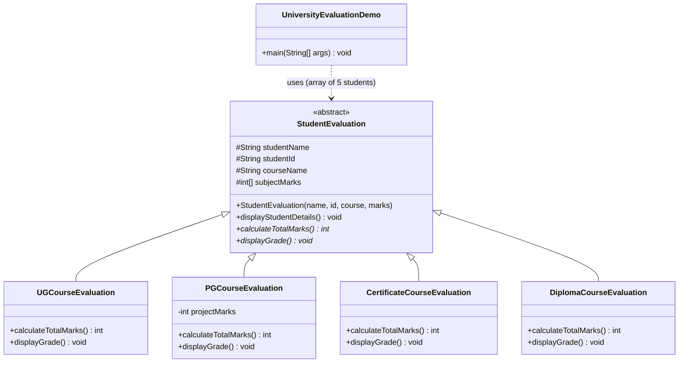

# Task 1 — Class Diagram (University Evaluation System)

**Notes for the hand-drawn diagram in your submission:**
- Draw `StudentEvaluation` at the top in an oval/rectangle labeled *abstract*.
- Draw four boxes below it (`UGCourseEvaluation`, `PGCourseEvaluation`, `CertificateCourseEvaluation`, `DiplomaCourseEvaluation`) connected to it with hollow-triangle arrows (inheritance), pointing **up** to the abstract class.
- `DiplomaCourseEvaluation` should be marked "added later — no change to StudentEvaluation".
