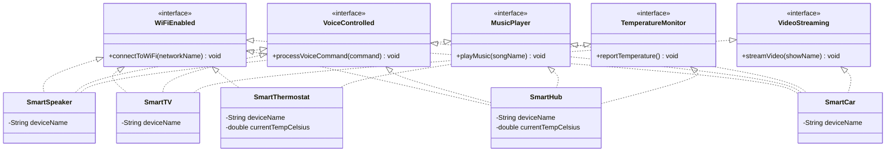

# Task 2 — Class Diagram (Smart Device Control System)

**Notes for the hand-drawn diagram in your submission:**
- Draw the 5 interfaces as ovals along the top labeled `<<interface>>`.
- Draw the 5 device classes as boxes below, with **dashed** arrows and hollow triangle heads pointing up to each interface they implement (dashed = "implements", solid = "extends").
- `SmartHub` and `SmartCar` should each show 3–4 dashed arrows, visually demonstrating multiple interface inheritance.
- Label `SmartCar` "added later — no interface modified".
