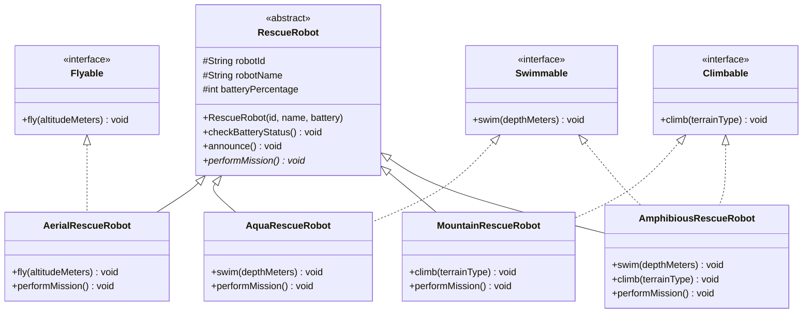

# Task 3 — Class Diagram (Emergency Rescue Robot)

**Notes for the hand-drawn diagram in your submission:**
- Draw `RescueRobot` at the top labeled `<<abstract>>`, with **solid** hollow-triangle arrows down to all four robot classes (inheritance).
- Draw `Flyable`, `Swimmable`, `Climbable` as separate interface ovals to the side, with **dashed** hollow-triangle arrows from the robot classes that implement them.
- `AmphibiousRescueRobot` should show two dashed arrows (to `Swimmable` and `Climbable`) — this is the multiple-inheritance case.
